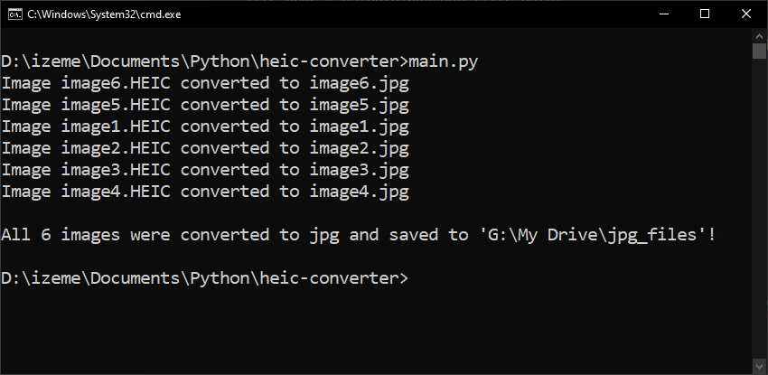

# HEIC-to-JPG converter
> Converting HEIC images to usable JPG images

This programs uses ImageMagick & the Wand library to convert HEIC images (coming from iPhone) to usable .JPG images.

## Installation
1. You first need to install **ImageMagick** on your machine. Depending on your OS, the installation may not be the same.
Follow the installation instructions here: https://docs.wand-py.org/en/0.6.7/guide/install.html#
2. Install the Wand library ``pip install Wand``

## Usage
1. Put the .heic files to be converted into the ``source_folder``. For example "G:\My Drive\heic_files"
2. Create a ``target_folder`` where the converted files will be placed. For example "G:\My Drive\jpg_files"
3. Run the program!

## Contact
Izem Mangione – [@Izem0](https://github.com/Izem0) – izem.mangione@gmail.com  
Project Link: https://github.com/Izem0/time_series_analysis/
